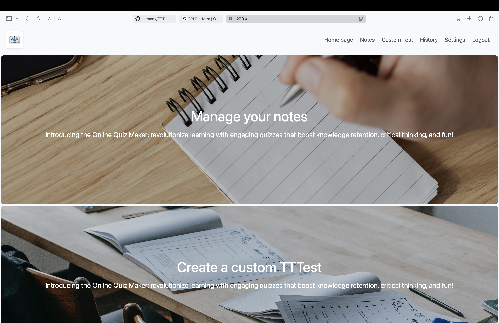
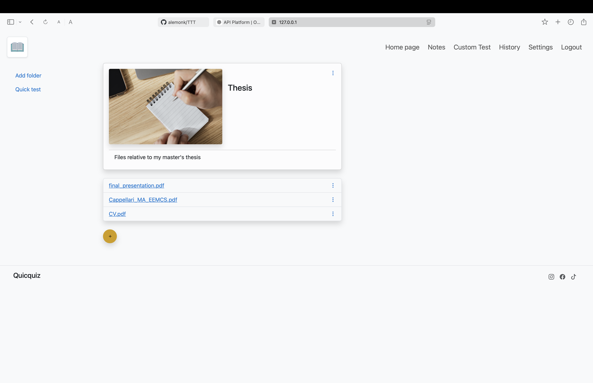
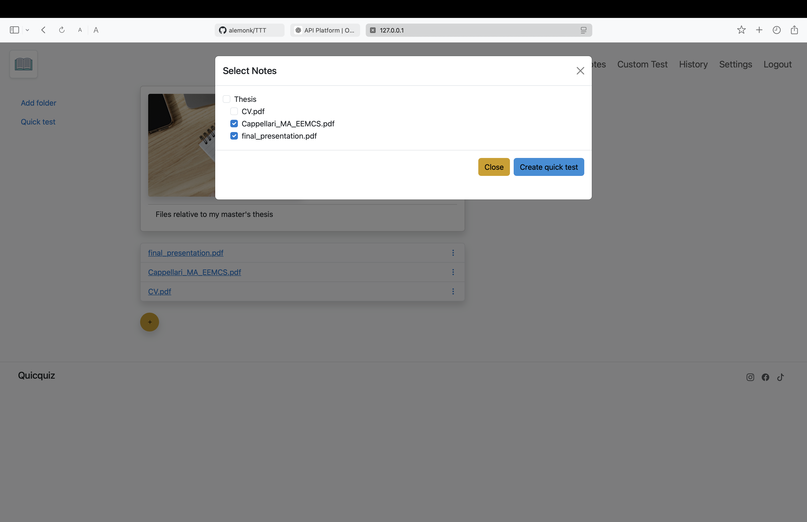
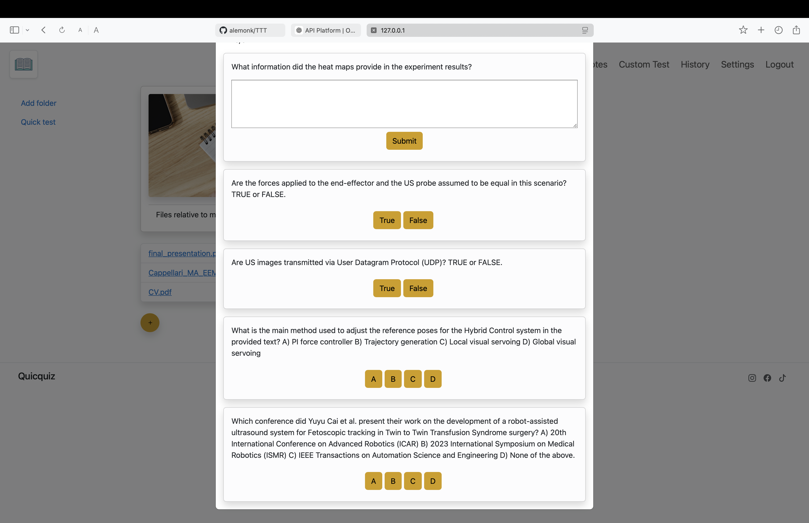
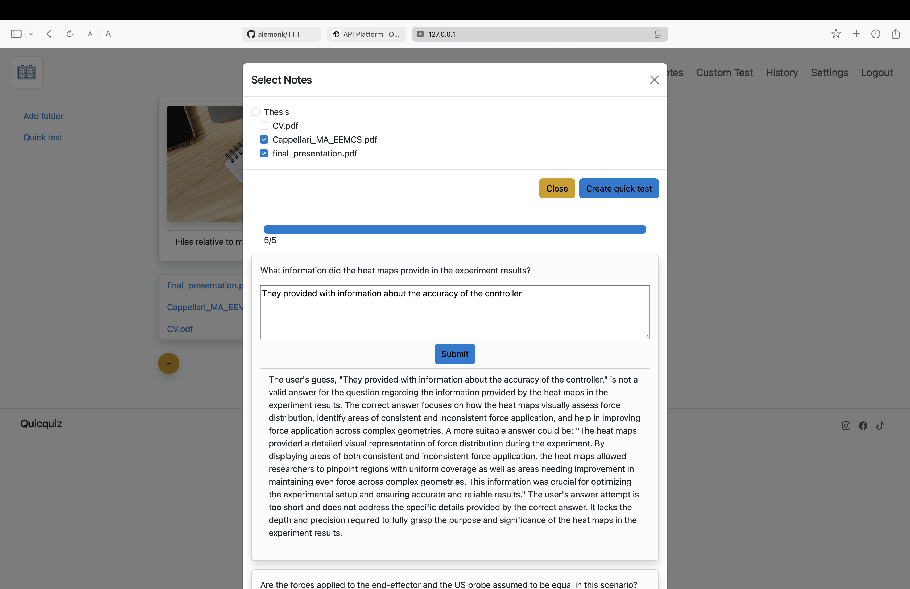
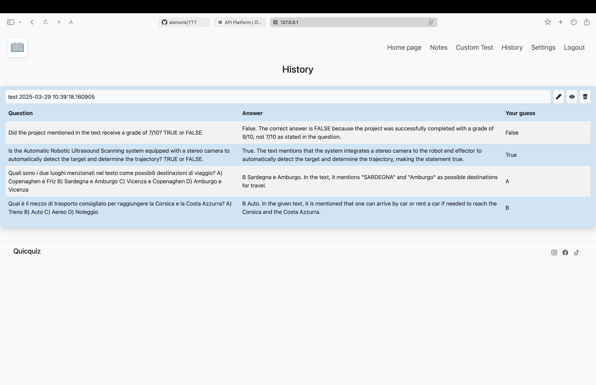

# University Notes Manager & Custom Test Generator

This project integrates **Python** and **JavaScript** to create a local web server for uploading and managing university notes. By leveraging the **ChatGPT API**, it scans uploaded files and generates personalized quizzes to enhance learning.

## Features
- **Effortless Note Management**: Upload and organize your university notes easily through a local web server.
- **Custom Quiz Generation**: Create personalized tests in various formats:
  - True/False
  - Multiple-choice (closed question)
  - Open-ended question
- **Full-Stack Integration**: Combines backend (Python) and frontend (JavaScript) technologies to ensure a seamless user experience.

## Ideal For
Students and educators seeking an efficient way to streamline study sessions and make the most of their learning materials.

## Interface Screenshots

### **1. Main Menu**
This is the main menu. All widgets across the interface are dynamic, meaning that they provide a visual feedback on hovering and clicking.

### **2. Upload Page**
This page allows users to upload notes.

### **3. Quiz Generation**
Users can select the type of questions and generate a quiz.

### **4. Sample Quiz**
Here’s an example of a quiz generated from the uploaded notes.

### **5. History**
It’s always possible to store the generated quizzes and review them later.
